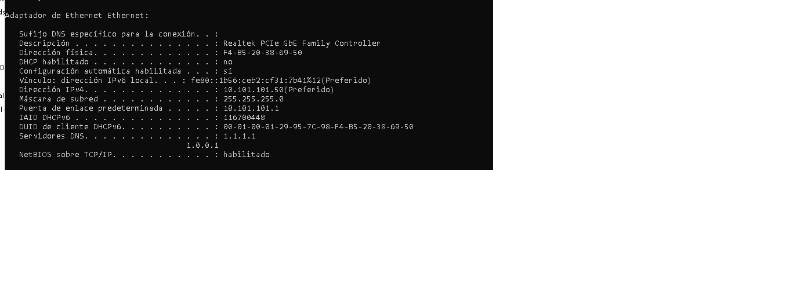
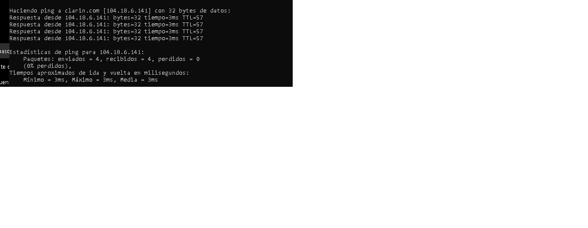
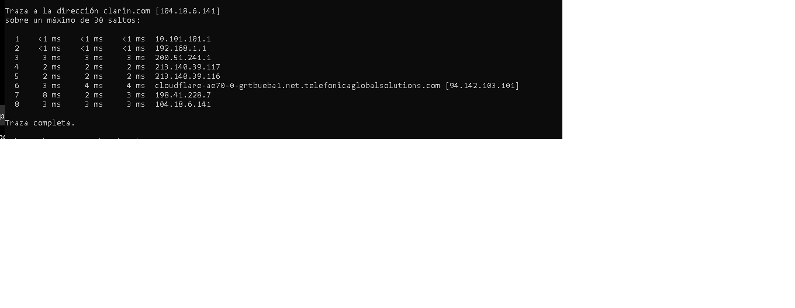
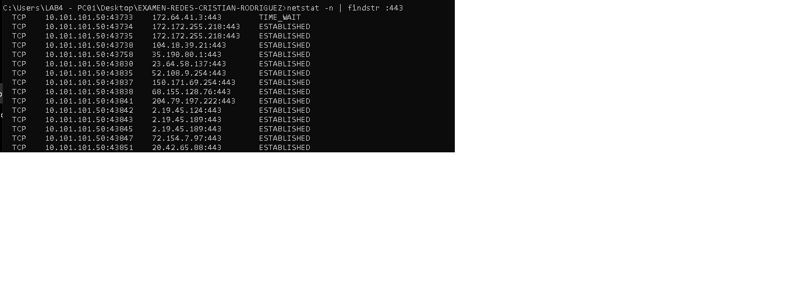
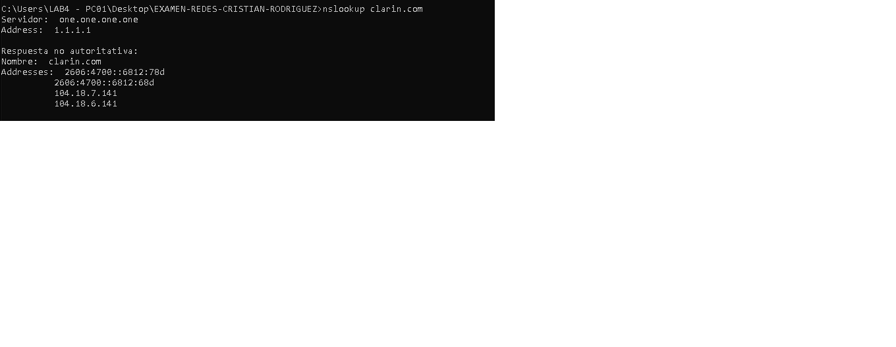

# TP Evaluativo - Redes

## Ítem 1 - Configurar IP estática y verificar conectividad
Configuraci¢n IP de Windows

   Nombre de host. . . . . . . . . : DESKTOP-3EFPTGJ
   Sufijo DNS principal  . . . . . : 
   Tipo de nodo. . . . . . . . . . : h¡brido
   Enrutamiento IP habilitado. . . : no
   Proxy WINS habilitado . . . . . : no

Adaptador de Ethernet Ethernet:

   Sufijo DNS espec¡fico para la conexi¢n. . : 
   Descripci¢n . . . . . . . . . . . . . . . : Realtek PCIe GbE Family Controller
   Direcci¢n f¡sica. . . . . . . . . . . . . : F4-B5-20-38-69-50
   DHCP habilitado . . . . . . . . . . . . . : no
   Configuraci¢n autom tica habilitada . . . : s¡
   V¡nculo: direcci¢n IPv6 local. . . : fe80::1b56:ceb2:cf31:7b41%12(Preferido) 
   Direcci¢n IPv4. . . . . . . . . . . . . . : 10.101.101.50(Preferido) 
   M scara de subred . . . . . . . . . . . . : 255.255.255.0
   Puerta de enlace predeterminada . . . . . : 10.101.101.1
   IAID DHCPv6 . . . . . . . . . . . . . . . : 116700448
   DUID de cliente DHCPv6. . . . . . . . . . : 00-01-00-01-29-95-7C-98-F4-B5-20-38-69-50
   Servidores DNS. . . . . . . . . . . . . . : 1.1.1.1
                                       1.0.0.1
   NetBIOS sobre TCP/IP. . . . . . . . . . . : habilitado

Adaptador de Ethernet VirtualBox Host-Only Network:

   Sufijo DNS espec¡fico para la conexi¢n. . : 
   Descripci¢n . . . . . . . . . . . . . . . : VirtualBox Host-Only Ethernet Adapter
   Direcci¢n f¡sica. . . . . . . . . . . . . : 0A-00-27-00-00-11
   DHCP habilitado . . . . . . . . . . . . . : no
   Configuraci¢n autom tica habilitada . . . : s¡
   V¡nculo: direcci¢n IPv6 local. . . : fe80::f5d6:75f8:4244:7031%17(Preferido) 
   Direcci¢n IPv4. . . . . . . . . . . . . . : 192.168.56.1(Preferido) 
   M scara de subred . . . . . . . . . . . . : 255.255.255.0
   Puerta de enlace predeterminada . . . . . : 
   IAID DHCPv6 . . . . . . . . . . . . . . . : 403308583
   DUID de cliente DHCPv6. . . . . . . . . . : 00-01-00-01-29-95-7C-98-F4-B5-20-38-69-50
   Servidores DNS. . . . . . . . . . . . . . : fec0:0:0:ffff::1%1
                                       fec0:0:0:ffff::2%1
                                       fec0:0:0:ffff::3%1
   NetBIOS sobre TCP/IP. . . . . . . . . . . : habilitado
### Salida del ping
Haciendo ping a clarin.com [104.18.6.141] con 32 bytes de datos:
Respuesta desde 104.18.6.141: bytes=32 tiempo=3ms TTL=57
Respuesta desde 104.18.6.141: bytes=32 tiempo=3ms TTL=57
Respuesta desde 104.18.6.141: bytes=32 tiempo=3ms TTL=57
Respuesta desde 104.18.6.141: bytes=32 tiempo=3ms TTL=57

Estadísticas de ping para 104.18.6.141:
    Paquetes: enviados = 4, recibidos = 4, perdidos = 0
    (0% perdidos),
Tiempos aproximados de ida y vuelta en milisegundos:
    Mínimo = 3ms, Máximo = 3ms, Media = 3ms
### Captura de IP

### Captura del Ping

### ¿Qué criterio usaste para elegir la IP estática?

Elegí una dirección IP libre dentro del mismo rango de red que la dirección obtenida por DHCP. De esta forma la PC sigue perteneciendo a la misma red y se evitan conflictos con otros dispositivos.

### ¿Por qué el enunciado prohíbe usar los DNS de Google?

Porque una organización puede tener políticas propias de red y preferir otros proveedores DNS por motivos de administración, privacidad, filtrado de contenido o rendimiento.
## Ítem 2 - Trazado de ruta y conexiones activas

### Salida de tracert

Traza a la direcci¢n clarin.com [104.18.6.141]
sobre un m ximo de 30 saltos:

  1    <1 ms    <1 ms    <1 ms  10.101.101.1 
  2    <1 ms    <1 ms    <1 ms  192.168.1.1 
  3     6 ms     3 ms    10 ms  200.51.241.1 
  4     5 ms    19 ms     2 ms  213.140.39.117 
  5    19 ms    19 ms     2 ms  213.140.39.116 
  6     4 ms     4 ms     4 ms  cloudflare-ae70-0-grtbueba1.net.telefonicaglobalsolutions.com [94.142.103.101] 
  7     3 ms     3 ms     3 ms  198.41.228.7 
  8     4 ms     3 ms     3 ms  104.18.6.141 

Traza completa.
### Salida de netstat
  TCP    10.101.101.50:43733    172.64.41.3:443        TIME_WAIT
  TCP    10.101.101.50:43734    172.172.255.218:443    ESTABLISHED
  TCP    10.101.101.50:43735    172.172.255.218:443    ESTABLISHED
  TCP    10.101.101.50:43738    104.18.39.21:443       ESTABLISHED
  TCP    10.101.101.50:43758    35.190.80.1:443        ESTABLISHED
  TCP    10.101.101.50:43830    23.64.58.137:443       ESTABLISHED
  TCP    10.101.101.50:43835    52.108.9.254:443       ESTABLISHED
  TCP    10.101.101.50:43837    150.171.69.254:443     ESTABLISHED
  TCP    10.101.101.50:43838    68.155.128.76:443      ESTABLISHED
  TCP    10.101.101.50:43841    204.79.197.222:443     ESTABLISHED
  TCP    10.101.101.50:43842    2.19.45.124:443        ESTABLISHED
  TCP    10.101.101.50:43843    2.19.45.189:443        ESTABLISHED
  TCP    10.101.101.50:43845    2.19.45.189:443        ESTABLISHED
  TCP    10.101.101.50:43847    72.154.7.97:443        ESTABLISHED
  TCP    10.101.101.50:43851    20.42.65.88:443        ESTABLISHED
### Captura de tracert

### Captura de netstat

### ¿En qué salto se ve el mayor aumento de latencia?

El mayor aumento de latencia se observa entre el salto 2 y el salto 3, donde el tiempo pasa de menos de 1 ms a valores de entre 3 ms y 10 ms. Esto podría indicar el paso desde la red local hacia la red del proveedor de Internet (ISP) o un cambio a un enlace de mayor distancia.

### ¿Hay alguna conexión establecida al puerto 443?

Sí. Se observan múltiples conexiones establecidas al puerto 443 (HTTPS). Por ejemplo:

* IP remota: 172.172.255.218
* Estado: ESTABLISHED

También existen otras conexiones HTTPS activas con distintas direcciones IP remotas. Esto indica que la computadora está intercambiando tráfico web seguro, algo habitual al navegar por Internet o utilizar aplicaciones conectadas a servicios en línea.
## Ítem 3 - Consultas DNS y Resource Records
### Salida de nslookup clarin.com
SServidor:  one.one.one.one
Address:  1.1.1.1

Respuesta no autoritativa:
Nombre:  clarin.com
Addresses:  2606:4700::6812:68d
          2606:4700::6812:78d
          104.18.6.141
          104.18.7.141
### Salida de nslookup -type=MX clarin.com
Servidor:  one.one.one.one
Address:  1.1.1.1

Respuesta no autoritativa:
clarin.com      MX preference = 0, mail exchanger = clarin-com.mail.protection.outlook.com
### Salida de nslookup google.com 1.1.1.1
Servidor:  one.one.one.one
Address:  1.1.1.1

Respuesta no autoritativa:
Nombre:  google.com
Addresses:  2800:3f0:4002:807::200e
          142.251.129.110
### Captura

### ¿Qué dirección IP devuelve el primer nslookup para clarin.com?

El comando nslookup para clarin.com devuelve las direcciones IPv4 104.18.6.141 y 104.18.7.141. También devuelve las direcciones IPv6 2606:4700::6812:68d y 2606:4700::6812:78d.

### ¿Cuántos servidores de correo (MX) aparecen y cuál tiene la prioridad más baja?

Aparece un único servidor de correo (MX):

clarin-com.mail.protection.outlook.com

Su prioridad es 0, por lo que es el servidor de correo con la prioridad más baja numéricamente y el principal para recibir correos del dominio.

### ¿Coincide el servidor DNS por defecto que muestra nslookup con el que configuraste como estático? ¿Por qué es importante tener al menos dos servidores DNS?

Sí. El servidor DNS que muestra nslookup es 1.1.1.1 (one.one.one.one), que coincide con el DNS configurado de forma estática. Es importante tener al menos dos servidores DNS para garantizar redundancia y disponibilidad. Si el servidor DNS principal falla, el equipo puede utilizar el DNS secundario para seguir resolviendo nombres de dominio.

